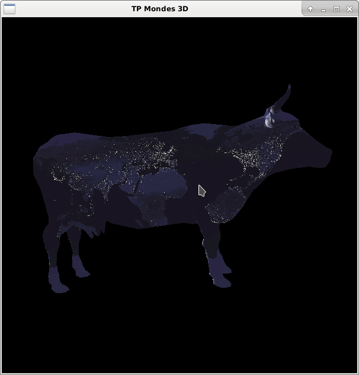
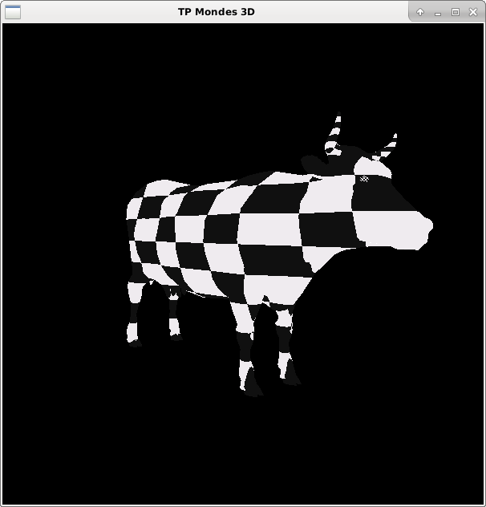
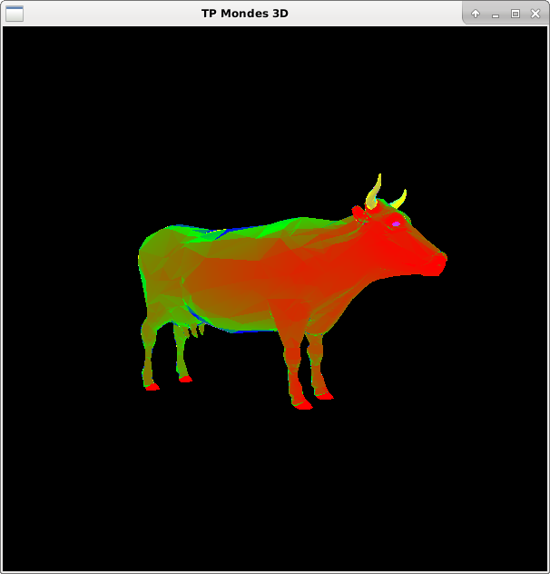

# **Rapport Mondes3D - Master 1 Informatique**

Author : Jimmy Gouraud  
Date : 10/03/2017

## TD7 - Texture

J'ai réussi à implémenter l'intégralité du TD7

Vous pourrez tester les différents rendus facilement (j'ai mis des commentaires "interactif", il suffit de rajouter ou d'enlever une "*" pour commenter/décommenter toute une partie de code).

Vous pourrez apprécier les différents rendus avec ces quelques images !

Les basiques :

Les plus originales :

Les mipmap:

Les tout-en-un :

