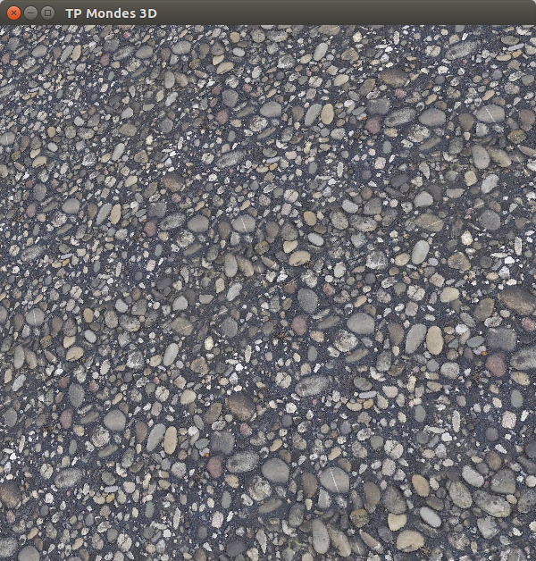
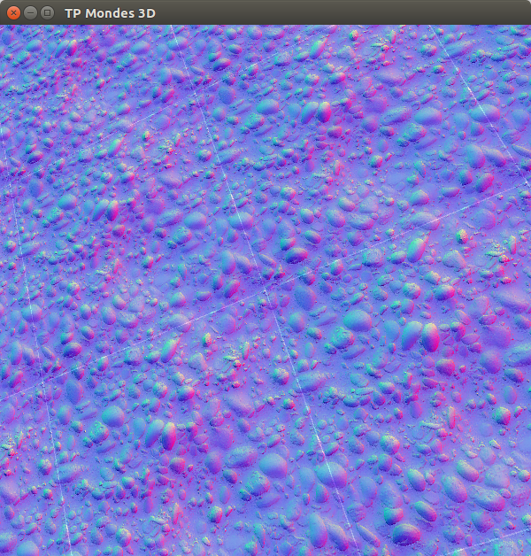
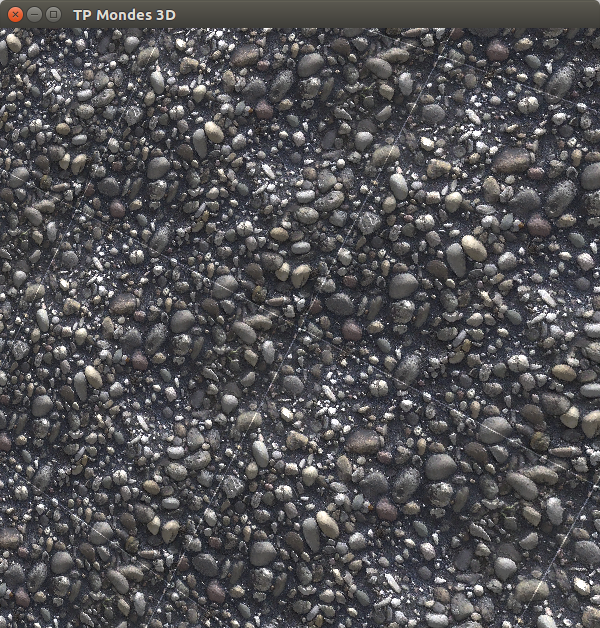
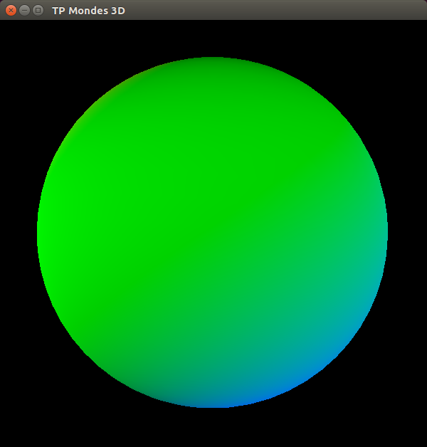
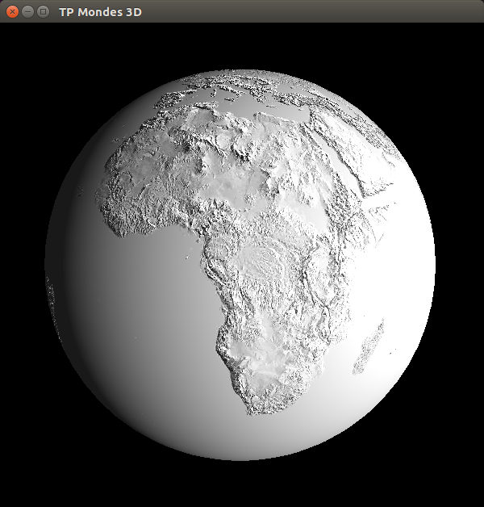
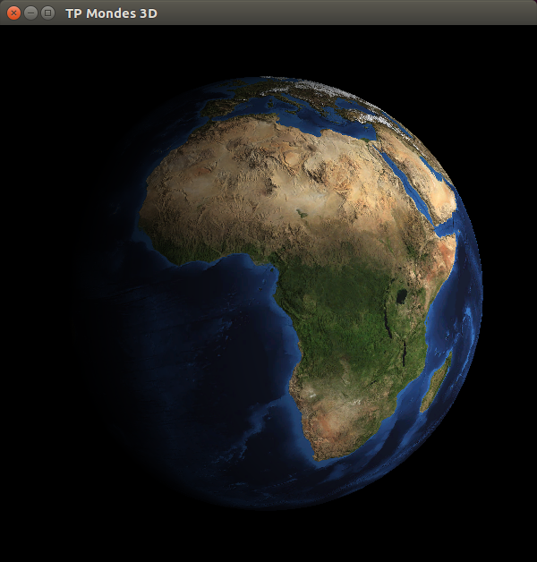

# **Rapport Mondes3D - Master 1 Informatique**

Author : Jimmy Gouraud  
Date : 24/03/2017

## TD8 - Normal mapping

J'ai réussi à implémenter l'intégralité du TD8.

###1 - Normal mapping sur un plan :

###2 - Calcul du repère tangent

###3 - Normal mapping sur une sphère

